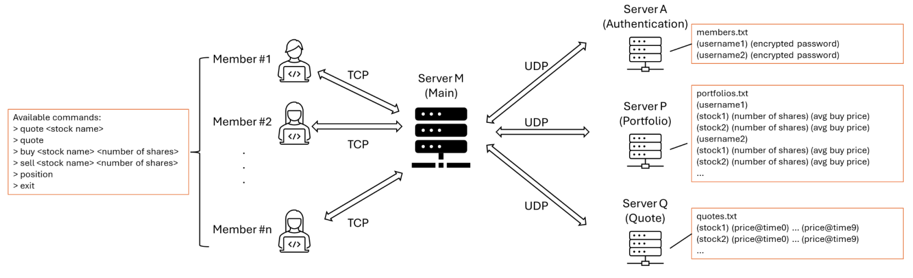

# EE450 Socket Programming Project - Spring 2025

## Assignment Summary  
In this assignment, I implemented a multi-server stock trading architecture using TCP and UDP sockets. The main server (serverM) handles TCP connections from clients and coordinates with three backend servers (serverA, serverP, and serverQ) using UDP. The project supports user authentication, stock quoting, buying, selling, and position reporting. I also implemented dynamic port handling, struct-based communication, password encryption, time-shifted stock pricing, and a portfolio system.



## Code Files and Their Descriptions

- `client.cpp`: Handles user input and communicates with serverM over TCP. Supports commands like quote, buy, sell, position, and exit.
- `serverM.cpp`: Main server that handles TCP clients and coordinates with backend servers over UDP.
- `serverA.cpp`: Authentication server that receives encrypted credentials and verifies them against a local database.
- `serverP.cpp`: Portfolio server that manages users’ stock portfolios and updates them on buy/sell transactions.
- `serverQ.cpp`: Quote server that handles stock price queries and maintains a time-shifted index for each stock.
- `Makefile`: Builds all binaries using `g++`.

## Message Format

---

### Client
#### → ServerM
- **Login Credentials**  
  Sent as a `Credentials` struct:
  ```cpp
  struct Credentials {
      char username[51]; // Max 50 characters + null terminator
      char password[51]; // Max 50 characters + null terminator
  };
  ```

- **Post-login Commands**  
  Plain text commands sent over TCP:
  - `quote`
  - `quote <stock>`
  - `buy <stock> <shares>`
  - `sell <stock> <shares>`
  - `position`
  - `exit`
- Buy/sell confirmation: `"Y"` or `"N"`
---

### ServerM
#### → Client
- login response
    - `"Login successful"` – if authentication passed.
    - `"Login failed"` – if authentication failed.
- quote response
    - Full list:
    ```
    "<stock1> <price1>
     <stock2> <price2>..."
    ```
    - Specific stock: `"<stock> <price>"`
    - error: `"<stock> does not exist. Please try again."`
- Buy/Sell Confirmation Prompt:
  - Sent after quote retrieval: `"<stock>’s current price is <price>. Proceed to buy/sell? (Y/N)"`
- Buy/Sell Final Response:
  - On success: <br> `"<username> successfully bought <shares> shares of <stock>."` <br>
    `"<username> successfully sold <shares> shares of <stock>."`
  - On failure: <br>
    `"Error: stock name does not exist. Please check again."` <br>
    `"Error: <username> does not have enough shares of <stock> to sell. Please try again"`
- position result:
  - Portfolio: 
  ```
    "stock shares avg_buy_price
    S1 100 450.5
    S2 50 600.0
    ...
    <username>’s current profit is <value>."
  ```

#### → ServerA (Authentication)
- struct `Credentials` (received from client)


#### → ServerQ (Quote Server)

- `"quote"` – for all stock prices  
- `"quote <stock>"` – for specific stock
- `"forward <stock>"` - Make a time forward request for the specific stock

#### → ServerP (Portfolio Server)

- `"check <username> <stock> <shares>"` – verify if user has enough stock to sell  
- `"Y <username> buy <stock> <shares> <price>"` – confirmed buy  
- `"Y <username> sell <stock> <shares> <price>"` – confirmed sell  
- `"N"` – user denied buy/sell  
- `"position <username>"` – request user’s portfolio

---

### ServerA
#### → ServerM (Authentication response)
  - `"Login successful"`  
  - `"Login failed"`
---

### ServerQ
#### → ServerM
- Stock list in format: `"<stock name1> <current price1>\n<stock name2> <current price2>\n ..."`

- Or single stock quote: `"<stock> <price>"`  
- Or error: `"<stock> does not exist. Please try again."`
---
### ServerP
#### → ServerM
  - `"OK"` or `"Insufficient shares"` – for `check` request from serverM
  - Transaction result messages after confirmed buy/sell
    -  `"<username> successfully bought <shares> shares of <stock>"`.
    - `"<username> successfully sold <shares> shares of <stock>"`.
  - Portfolio: multiline text, each line: `"<stock> <shares> <avg_price>"` and last line `"<username>’s current profit is <gain value>."`
---

## Project Idiosyncrasies

- If the client disconnects unexpectedly (e.g., via Ctrl+C) during login or confirmation phases, the server may show a "disconnected" message and continue normally.
- Buffer size limits apply to messages. Messages beyond 8192 bytes are not supported.
- The project assumes that usernames and stock symbols are ASCII strings of reasonable length (<50 chars).

## Reused Code

- No external code was reused. 

## Ubuntu Version

- The project was developed and tested on the provided **studentVM(64-bit)**.
